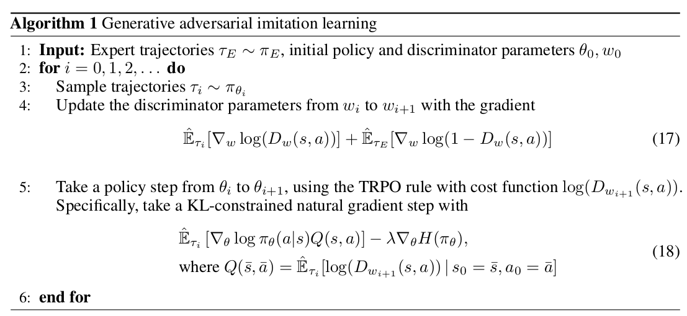

# Reading-Record
#### 1. Generative Adversarial Imitation Learning
##### Abstract
Consider learning a policy from example expert behavior, without interaction with the expert or access to reinforcement signal.仅仅通过对专家行为的示例学习到策略，而无需专家的交互，强化学习的信号。
与GAN应用的场景类似，GAN一般是使生成的图片与数据库里的图片尽可能类似，这篇是使学习的到的策略与专家行为尽可能类似。

##### Algorithm

