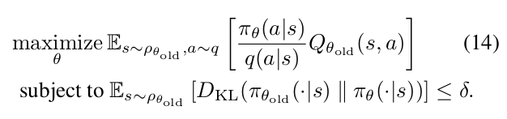

# Reading-Record
#### 1. Generative Adversarial Imitation Learning
##### Abstract
Consider learning a policy from example expert behavior, without interaction with the expert or access to reinforcement signal.仅仅通过对专家行为的示例学习到策略，而无需专家的交互，强化学习的信号。
与GAN应用的场景类似，GAN一般是使生成的图片与数据库里的图片尽可能类似，这篇是使学习的到的策略与专家行为尽可能类似。

##### Algorithm

##### Code
GitHub：https://github.com/openai/imitation

#### 2. Trust Region Policy Optimization （TRPO）
##### Abstract
We describe a iterative procedure for optimizing policies, with guaranteed monotonic improvement. By making several approximations to the theoretically-justified procedure, we develop a practical algorithm, called Trust Region Policy Optimization (TRPO). This algorithm is similar to natural policy gradient methods and is effective for optimizing large nonlinear policies such as neural networks.
一种保证能单调改进的优化策略。经过一系列的近似，得到了一种实用的优化策略TRPO。通过引入旧策略和更新策略所预测的概率分布之间的KL距离，来控制参数更新的过程。
##### Algorithm
理论得出的算法

single path and vine

近似后的问题

近似后的算法

##### Code
GitHub：https://github.com/openai/imitation
#### 3. REINFORCEMENT LEARNING WITH UNSUPERVISEDA AUXILIARY TASKS （UNREAL）
##### Abstract
采用A3C架构，通过增加附加任务来加速训练速度，提高学习精度。

